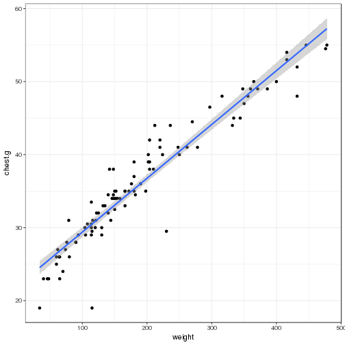

Bears
========================================================
author: Mitch Holman
date: 5/4/18
width: 1440
height:900

Code
========================================================

```r
library(MASS)
library(partykit)
library(readxl)
Br <- read_excel("bearMFs.xls")
set.seed(38)
index <- sample(nrow(Br), size = (.5 *(nrow(Br))))
test <- Br[index, ]
trainb <- Br[-index, ]
mod <- lm(weight ~ . , data = trainb)
summary(mod)
tree1 <- rpart(mod, data = trainb)
pred_tree <- predict(tree1, newdata = test)
RSME_T <- sqrt(mean((pred_tree - test$weight)^2))
RSME_T
```
Results
========================================================


```

Call:
lm(formula = weight ~ ., data = trainb)

Residuals:
    Min      1Q  Median      3Q     Max 
-70.667 -21.628  -1.214  18.665 116.013 

Coefficients:
             Estimate Std. Error t value Pr(>|t|)    
(Intercept) -213.1744    35.4529  -6.013 3.81e-07 ***
sexMale        4.1212    13.3165   0.309  0.75849    
age            3.7704     2.6145   1.442  0.15670    
length        -1.0532     1.4773  -0.713  0.47983    
head.l        -4.7908     5.6672  -0.845  0.40270    
head.w         0.4894     6.1131   0.080  0.93658    
neck.g        10.6796     3.7377   2.857  0.00662 ** 
chest.g        7.5782     2.1452   3.533  0.00102 ** 
---
Signif. codes:  0 '***' 0.001 '**' 0.01 '*' 0.05 '.' 0.1 ' ' 1

Residual standard error: 34.3 on 42 degrees of freedom
Multiple R-squared:  0.9261,	Adjusted R-squared:  0.9138 
F-statistic: 75.19 on 7 and 42 DF,  p-value: < 2.2e-16
```

```
[1] 47.656
```

```
[1] 30.90136
```

Plots
========================================================


```r
library(DT)
library(ggplot2)
library(effects)
library(car)
ggplot(data = Br , aes(x = weight, y = chest.g )) + 
  geom_point() + 
  theme_bw() + 
  stat_smooth(method = "lm", formula = y ~ poly(x, 1))
```


